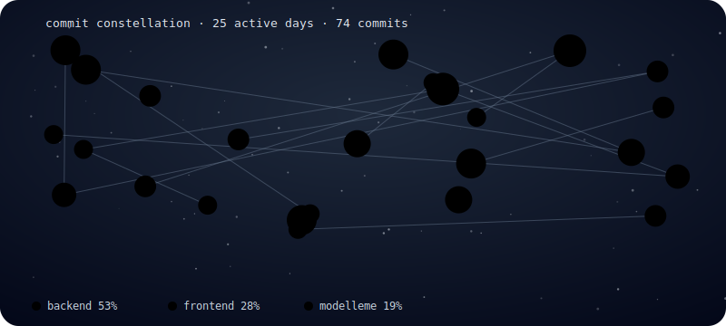

<h1 align="center"> Hi, I am Ekin!</h1>

<h3 align="center">I am a software engineering student at UTAA. I'm passionate about ML and AI.</h3>

  

## What will I code tomorrow?

<!--START_SECTION:ml-prediction-->
Not enough commit history yet to make a prediction — check back in a few days!
<!--END_SECTION:ml-prediction-->

 

## About This Week

<!--START_SECTION:weekly-summary-->
No commits logged yet this week.
<!--END_SECTION:weekly-summary-->

 

## About Me

- 🌱 Currently learning: designing & evaluating LLM systems — structured JSON output, prompt calibration, RAG-grounded chat, and writing eval harnesses that actually catch regressions

- 🔭 Currently working on: NextGenCV — an AI career assistant (FastAPI + Gemini) that scores CVs against 22 roles, generates learning paths, and coaches users via a RAG chatbot

- 💡 Interested in: machine learning

- 📫 Reach me: karincaliekin@gmail.com

 

## 🛠️ Tech Stack

