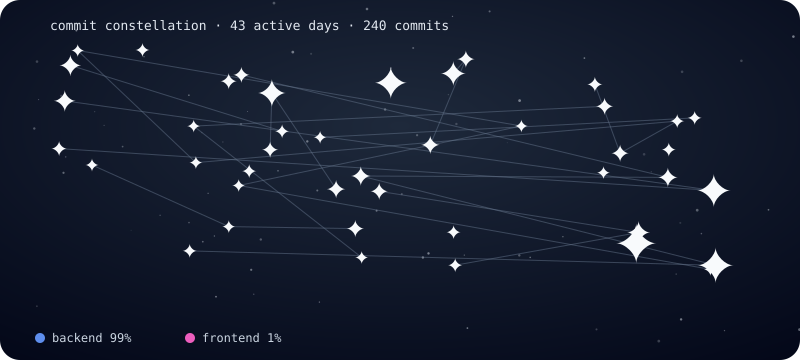

<h1 align="center"> Hi, I am Ekin Karıncalı!</h1>

<h3 align="center">I am a software engineering student at UTAA. I'm passionate about ML and AI.</h3>

  

## What will I code tomorrow?

<!--START_SECTION:ml-prediction-->
🤖 **AI prediction** (for Monday): most likely I'll be working on 91% ⚙️ backend and 9% 🎨 frontend.

Last updated: 2026-08-23 21:09 · generated using a RandomForest model trained on my past commit data
<!--END_SECTION:ml-prediction-->

 

## About This Week

<!--START_SECTION:weekly-summary-->
📊 **This week:** 29 commits · mostly in **Python** (backend) · most productive day so far: **Tuesday** (10 commits)
<!--END_SECTION:weekly-summary-->

 

## About Me
- 🌱 Currently learning: building end-to-end mobile + AI products — cross-platform Flutter clients on top of FastAPI services, hybrid relational/document data models (SQLite + MongoDB), on-device ML, and RAG pipelines that ground LLM answers in a real recipe corpus instead of hallucinating them
- 🔭 Currently working on: Kiler — a calorie tracker & smart pantry assistant (Flutter + FastAPI + Groq/LLaMA 3) that tracks what's actually in your kitchen via photograph scanning and Open Food Facts and answers "what can I cook without blowing my calorie budget?" with RAG-grounded recipe suggestions, plus auto-generated shopping lists from low-stock items.
    
  
 
- 💡 Interested in: Machine Learning, AI 
- 📫 Reach me: karincaliekin@gmail.com
 

 

## 🛠️ Tech Stack

